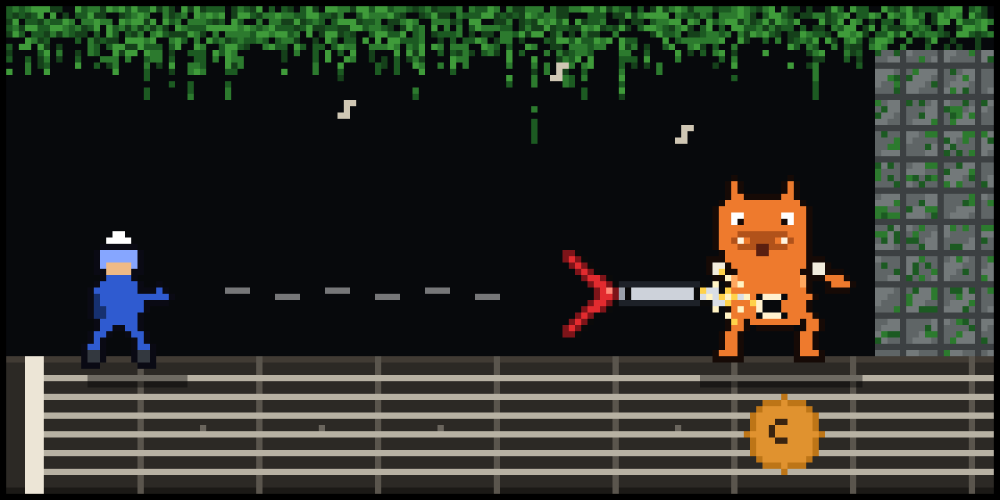

# 🎸 Guitar Trainer



An interactive web app for learning the guitar fretboard, major scales, and
movable CAGED shapes. Built with [Vite](https://vitejs.dev/), a custom SVG
fretboard (music theory via [fretboard.js](https://github.com/moonwave99/fretboard.js)),
and [VexFlow](https://www.vexflow.com/) for standard notation + TAB.

**Live site:** https://schneider128k.github.io/guitar/

## Current prototype

| Tab | What it does |
| --- | --- |
| **Guided Path** | A structured curriculum that sequences Find-Note drills — open position (to fret 5) first, then the full neck (to fret 12). Tracks lesson progress + a daily streak in `localStorage`. |
| **Find Notes** | Two-phase **Learn → Quiz**: study every position of a target note (e.g. all C's), then find them from memory by clicking. Open strings included; scored with progress pips, mistakes + time. |
| **Name the Note** | A position is highlighted; pick its name from four choices. |
| **🎤 Play** | The app names a note; you **play it on the guitar** and the mic confirms the pitch (pitchy + Web Audio), with a live tuner. Works in Safari on iPhone/iPad — tap to grant mic access. |
| **Open-Position Scales** | Browse the five first-position major scales (C, G, D, A, E) as fretboard + notation + TAB. |
| **CAGED Shapes** | Explore the 5 movable major-scale shapes in any key; toggle note names / scale degrees. |

Also: **selectable neck skins** (Studio / Acoustic / Electric / Metal, remembered
across visits) and a **rotating guitarist quote** on each load.

## Roadmap ideas

- Scale quizzes (identify the key / complete the scale).
- 3-notes-per-string shapes; chords.
- Add sharps/flats to the note drills; Name-the-Note lessons in the Guided Path.

## Develop

```bash
npm install
npm run dev      # local dev server
npm run build    # production build to dist/
npm run preview  # preview the production build
```

Deployment is automated: pushing to `main` triggers
`.github/workflows/deploy.yml`, which builds and publishes to GitHub Pages.
